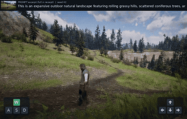
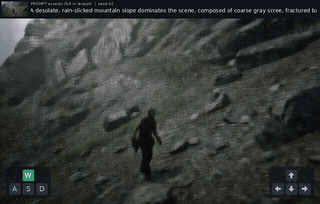
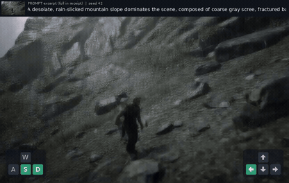

# InterActWorld

**基于 Wan2.2 的动作条件视频生成与世界模型探索原型。**

在官方 Wan2.2-TI2V-5B 预训练基座上训练动作 Adapter 和 LoRA，将首图、静态场景文本及按键时间线接入视频生成，并提供异步网页 Demo。复用 ABot 兼容的控制接口与部分训练思路，不使用其成品模型代替本项目训练，也不把上游实时性能当成本项目结果。

新增 [InterActWorld Creator](docs/creator.md)：自然语言编排、严格动作计划、真实视频生成、局部修改与版本比较。已验证两版真实输出，以及保留240帧前进输入、将抬头输入从120帧缩短到60帧的编辑约束；这不代表画质或动作响应改善。视觉反馈未达到可靠自动修订标准，默认人工审核，运行失败及恢复记录保留。本轮是推理工作流，没有新增 RL 训练。详见[实测状态与启动方法](docs/creator.md)和[面试讲解](docs/creator-interview.md)。

## Demo 视频与版本对照

### 精选生成样例

从现有视频中，按人物与场景完整度、重影程度和视角表现，选择以下 **3 段完整15秒样片**。均使用自训 **Action R005 step1040＋window6**。这是人工挑选的展示结果，不是随机样本或平均质量评测；仍有末段细节软化，不宣称所有动作都稳定可控。

#### 1. 草地场景：前进＋抬头

天空、树木与人物在已查看的首、中、末段均可辨，画面较明亮，作为首选演示。输入为W＋间歇↑。

[](https://huanyn.github.io/InteractWorld/#pair-b-forward-up)

[观看完整16 FPS视频](https://huanyn.github.io/InteractWorld/#pair-b-forward-up)

#### 2. 山地场景：前进＋左转

人物与山体保持可辨，场景与上一段不同；后段肢体和纹理仍会软化。输入为W＋间歇←。

[](https://huanyn.github.io/InteractWorld/#pair-a-forward-left)

[观看完整16 FPS视频](https://huanyn.github.io/InteractWorld/#pair-a-forward-left)

#### 3. 原固定展示：抬头、低头与移动

保留原网页真实生成样片：中段可见天空和山脊，随后视角回到地面，比单一方向更适合展示动作时间线。人物仍有软变形，方向变化不是逐帧控制精度验证。

[](https://huanyn.github.io/InteractWorld/#action-r005-1040-window6)

[观看完整16 FPS视频](https://huanyn.github.io/InteractWorld/#action-r005-1040-window6)

顶部是实际首图和静态提示词，左侧WASD、右侧箭头表示模型收到的控制输入。GIF为4 FPS压缩抽帧预览，点击图片或“观看完整16 FPS视频”进入在线播放器，可播放、拖动和全屏观看实际视频；没有剪去后半段、插帧或循环补时。上述历史展示页的更新仅重新选片和调整展示；Creator 的新增运行及其验证状态单独记录，不借用这些样片作为本轮结果。

### 训练过程与完整对照

| 关键阶段 | 改动与实际结果 | 详细记录 |
| --- | --- | --- |
| Action R004 | 改用静态场景文本；flow指标小幅改善，但仍有重影 | [版本变化与指标](docs/version-history.md) |
| Action R005＋window6 | 自训Adapter＋LoRA，选择6+6+3秒续写；以上为精选完整样片 | [固定展示配置](docs/demo-window6-v1.md) |
| native97 / 因果误差回收 | 长窗与历史适配探索；尚未形成可替换展示版的稳定质量结果 | [历史样片与失败结果](docs/demo-gallery.md) |

**完整的两组同图文、同seed、不同动作对照**仍保存在[配对实验页](docs/action-control-pairs.md)，包括未选上首页的两段反向控制。新自定义动作没有对应未来GT，不报告或借用历史RGB MSE。首页精选不是完整消融对照，失败证据和各版数据不删除。

[13段历史视频归档](docs/demo-gallery.md) · [版本改动与指标](docs/version-history.md) · [配对条件和媒体清单](assets/demos/manifest.json) · [在线历史播放器](https://huanyn.github.io/InteractWorld/docs/demo-gallery.html)

## 当前固定展示版

截至 2026-09-13，展示方案固定为 **Action R005 step1040 + window6**。后续因果、少步与历史扰动实验保留为研究分支，不自动替换这个版本。

| 项目 | 固定方案 |
| --- | --- |
| 权重 | 自训 Action Adapter + rank16 LoRA，step1040 |
| 输入 | RGB 首图、固定场景文本、240×8 二值动作、seed |
| 动作 | `W,A,S,D,I,J,K,L`；界面方向箭头对应 `I,J,K,L` |
| 推理 | 显式 `--inference-mode window6`；6+6+3 秒顺序续写 |
| 采样 | 每窗40步 flow Euler，shift5，BF16，无 CFG |
| 输出 | 832×480、241帧、16 FPS；带输入栏版本832×528 |
| 速度边界 | 已归档单次网页任务总处理约139.111秒；不是实时16 FPS |

文件时长为15.0625秒，首尾帧跨度15秒。已有单场景样例可用于异步演示，但仍有模糊、肢体软变形，**不宣称普遍稳定的长视频、可靠动作控制或实时交互**。该展示配置尚无完整同配置 zero/shuffled 对照，其他推理分区的数值结果不能转借为本版的控制结论。

完整参数与版本区别见 [固定展示说明](docs/demo-window6-v1.md) 和 [机器可读版本档案](docs/demo-window6-v1.json)。档案是版本说明，不是可直接执行的配置，更不附带模型权重。

## 系统与训练链路

```text
公开视频 + 对齐按键 + 静态场景文本
        ↓ manifest / VAE与文本缓存
冻结 Wan 基座，训练 Action Adapter + LoRA
        ↓ 可恢复 checkpoint
首图 + 文本 + 动作时间线
        ↓ window6：6秒 → 生成末帧重编码 → 6秒 → 同样续写3秒
异步任务队列 → 原视频 / 输入栏视频 / 来源收据
```

- 动作是真实数值条件，不只是拼到 prompt 中；每4帧按固定键序打包为32维控制。
- 训练与推理保存数据、配置、checkpoint 身份；严格 resume 与仅继承权重的新阶段明确区分。
- 展示版训练片段为49 RGB帧。6秒窗口是推理选择，不能说该 checkpoint 来自后续97帧训练。
- 后窗只使用前窗生成的浮点 RGB 末帧，不读取真实未来帧，也不循环或插帧凑视频时长。
- 网页固定首图与场景文本，可编辑动作时间线和 seed；顶部显示输入，左下 WASD、右下方向箭头显示模型收到的动作。
- 新网页任务调用自训模型，不以历史录像冒充新生成；没有模型或授权时直接拒绝生成。

## 快速开始：先做 CPU 检查

仓库提供最小源码、配置、测试及明确选定的自训生成样片：13段历史归档及4段完整配对实验，首页精选其中3段。不包含模型权重、原始数据集视频、特征缓存、运行日志或私人部署/授权记录。克隆后可以运行 CPU 契约测试；**不能在缺少模型资产时一键生成上述视频**。

以下为 Linux Bash 示例。参考 CPU 环境为 Python3.12，依赖以仓库文件为准；虚拟环境、包缓存和后续训练资产应放在自己的可写数据盘。

```bash
git clone https://github.com/HuanYn/InteractWorld.git
cd InteractWorld
export INTERACTWORLD_ROOT=/absolute/path/on/data-disk/interactworld
mkdir -p "$INTERACTWORLD_ROOT"
export PIP_CACHE_DIR="$INTERACTWORLD_ROOT/cache/pip"
python3.12 -m venv "$INTERACTWORLD_ROOT/venv-cpu"
source "$INTERACTWORLD_ROOT/venv-cpu/bin/activate"
python -m pip install torch==2.8.0 --index-url https://download.pytorch.org/whl/cpu
python -m pip install -r requirements-cpu.txt
CUDA_VISIBLE_DEVICES='' HF_HUB_OFFLINE=1 TRANSFORMERS_OFFLINE=1 \
  python -m pytest -q tests/test_demo_window6_action.py tests/test_demo_euler_precision.py
```

仓库不配置 GitHub 自动 CPU 测试流水线；保留本地测试，按需运行。FFmpeg/FFprobe 用于媒体检查。CPU 测试使用小张量或测试替身，不代表真实 GPU 模型、画质或控制已验收。GitHub Pages 仅负责公开视频播放器的发布。

## 准备固定版 Demo

操作方需要合法取得 Wan 基座/VAE、自训 checkpoint、原始训练 YAML、manifest/特征及静态文本缓存与收据，以及 RGB 首图和 `[240,8]` 二值 float32 动作文件。必须保持真实来源，不能伪造哈希或改写父训练配置来通过检查。

下面仅做 CPU 准备；路径替换为自己的数据盘。固定样片的 checkpoint SHA 在[版本档案](docs/demo-window6-v1.json)中。若用自己重新训练的模型，应填写其实际 SHA，并说明这不是同一个固定 checkpoint。

```bash
CUDA_VISIBLE_DEVICES='' HF_HUB_OFFLINE=1 TRANSFORMERS_OFFLINE=1 \
python -m training.demo.prepare_action \
  --training-config /DATA_DISK/assets/original-action.yaml \
  --checkpoint /DATA_DISK/assets/step-0001040.pt \
  --checkpoint-sha256 EXACT_CHECKPOINT_SHA256 \
  --initial-frame /DATA_DISK/assets/initial.png \
  --episode-id ACTUAL_HELD_OUT_EPISODE_ID \
  --action-input /DATA_DISK/assets/actions.npy \
  --initial-origin decoded_condition_rgb --seed 42 \
  --inference-mode window6 \
  --output /DATA_DISK/demo/rollout-action.yaml
```

固定展示首图来自 conditioning latent 解码，故使用 `decoded_condition_rgb`；真正原始 RGB 图使用 `source_rgb`。不要混称二者，也不要将新 RGB 输入协议与冻结 latent/noise 的诊断协议合并比较。`window6` 必须显式指定；通用 CLI 默认仍是 `chunked`，本次不改变旧调用行为。

按照 [部署说明](training/demo/README.md)准备自己的 `deployment.json`，绑定上一步 rollout 配置。保持 `host: "127.0.0.1"`，将 `guard_command` 留空即可只预览界面：

```bash
CUDA_VISIBLE_DEVICES='' python scripts/serve_abot_demo.py \
  --deployment /DATA_DISK/demo/deployment.json
```

空 guard 会拒绝提交生成。启用真实 GPU 工作需要操作方提供有效授权、即时 GPU/空间/预算检查与全套模型资产；运行示例不是本项目或任何机器的使用许可。不要以恒真函数、伪造时间戳或历史授权绕过当前规则。

## 自行训练与研究分支

Action R005 的结构模板见 [R005配置](configs/train/action_teacher_5090_repair_r005.yaml)：action scale0.03、Adapter LR2e-5、LoRA LR2e-6、rank16、microbatch1×accum8、BF16。模板最初计划780步，固定展示选取同运行扩展后的step1040；使用原始配置与真实checkpoint记录，不为凑版本号改写来源。配置是历史实现参考，不保证重新训练得到相同样片。

基座/数据版本、缓存、训练 CLI 和历史三阶段流程见 [训练参考](docs/research-training-reference.md)。该参考不是固定展示版的一键流水线；尤其 **不需要为了运行 Action Demo 再训练因果或蒸馏模型**。

| 分支 | 当前公开定位 |
| --- | --- |
| Action + window6 | 本次固定的异步展示方案，质量与泛化边界见上文 |
| native97 / 因果 / context error recycling | 研究实现，未形成可替换展示版的长期质量结果 |
| LongForcing-lite | 曾完成80步训练但生成失败；简化少步终点蒸馏，不是完整官方方法或DMD |
| history-noise / clean 对照 | 各20步后15秒视觉失败；GT历史加噪不是完整自生成历史训练，不默认续训 |
| DMD / 新teacher-flow | 不属于本次固定展示交付，未作为成功方案发布 |

[历史误差回收说明](docs/context-error-recycling.md)、[双向辅助训练说明](docs/moba-inspired.md)用于理解实验入口。训练 loss 下降、进程结束、视频有15秒、模型准确响应动作，是不同层面的结论；失败实验不包装成已验证的改进。

## 代码导航

| 路径 | 内容 |
| --- | --- |
| [training/data](training/data) | 数据与动作对齐、缓存读取、采样 |
| [training/models](training/models) | 动作适配器与LoRA |
| [train_action_teacher.py](train_action_teacher.py) | Action训练、阶段迁移与恢复 |
| [training/demo](training/demo) | 输入契约、Action推理、异步服务与页面 |
| [training/creator](training/creator) | 自然语言计划、局部编辑、版本管理与受限视觉反馈 |
| [scripts](scripts) | 数据、缓存、配置和媒体工具 |
| [tests](tests) | CPU契约与边界测试 |
| [REPRODUCTION.json](REPRODUCTION.json) | 脱敏源码导出身份与逐文件哈希 |

## 来源与许可

基于 [AMAP CV Lab / ABot-World](https://github.com/amap-cvlab/ABot-World)，使用 [Wan2.2](https://github.com/Wan-Video/Wan2.2) 模型代码与基座，数据来自 [ABot-World-Explorer-500h](https://huggingface.co/datasets/acvlab/ABot-World-Explorer-500h)。本项目主要工作是受资源约束的训练/适配实现、输入契约、恢复和部署链路及真实诊断，不将上游架构或性能作为原创成果。

保留 [LICENSE](LICENSE)、[NOTICE](NOTICE) 和 [THIRD_PARTY_NOTICES.md](THIRD_PARTY_NOTICES.md)。模型与数据还需遵守各自许可，代码许可不自动覆盖它们。公开样片仅限本项目明确选定的生成结果，不分发上游宣传视频、原始数据集视频、权重或其他私有实验资产。
