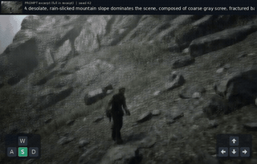
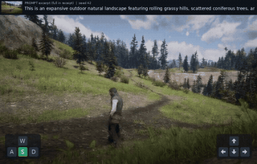

# 同输入动作与视角对照：完整实验归档

四段来自同一个固定checkpoint的两组实验。首页按画面表现挑选样片；本页保留完整配对，包括后段人物难辨、变形较重的结果，不能只用首页精选推断全部控制方向的表现。

[返回精选 Demo](../README.md#demo-视频与版本对照) · [历史版本结果](version-history.md)

## 两组固定图文、不同控制

以下使用固定的 **Action R005 step1040＋window6**，不为这四段重新训练。每组内固定同一首图、提示词、seed、checkpoint 和采样参数，只改变动作与视角控制；两组使用不同场景。顶部保留首图和提示词，左侧显示 WASD，右侧显示方向键。按键表示模型收到的控制输入，不等于模型已准确执行。

四段均于2026-09-13真实生成完成，完整241帧/16 FPS；没有重新训练、插帧或循环补时。配对内的图文、初始latent和噪声哈希一致，控制动作不同；详细绑定与实测值见[媒体清单](../assets/demos/manifest.json)。

| 第一组：山地场景，同首图、同提示词 | 第一组：相同图文输入 |
| --- | --- |
| **前进＋左转视角：W＋←** | **后退＋右转视角：S＋→** |
|  |  |
| [在线播放完整视频](https://huanyn.github.io/InteractWorld/#pair-a-forward-left) | [在线播放完整视频](https://huanyn.github.io/InteractWorld/#pair-a-backward-right) |

| 第二组：草地、丘陵与树木，同首图、同提示词 | 第二组：相同图文输入 |
| --- | --- |
| **前进＋抬头：W＋↑** | **后退＋低头：S＋↓** |
|  |  |
| [在线播放完整视频](https://huanyn.github.io/InteractWorld/#pair-b-forward-up) | [在线播放完整视频](https://huanyn.github.io/InteractWorld/#pair-b-backward-down) |

GIF 是压缩抽帧预览；点击图片或“在线播放完整视频”进入播放器，观看保留原帧的完整 MP4，每段首尾帧跨度为15秒。两组是自定义控制的展示对比，没有对应的真实未来 GT，不报告其 RGB MSE，也不把历史样片分数移植到这些新视频上。固定 seed 有助于对照，但两对样片不能证明可靠控制或跨场景泛化。

动作时序为五个3秒周期：移动1秒 → 移动＋视角键0.5秒 → 移动1.5秒，共240行真实动作输入。GIF为4 FPS、320像素宽的抽帧预览，不代表推理速度。四段通过与网页相同的window6后端离线批处理生成，未修改原网页的默认场景。第一组首图是既有conditioning latent解码图，第二组使用既有原始RGB首图；配对内的输入协议保持一致。

| 本次样片 | 实际模型生成耗时 | 有限抽帧观察（0 / 7.5 / 15秒） |
| --- | --- | --- |
| 山地：W＋← | 130.60秒 | 人物和场景保留，末段细节与人形软化 |
| 山地：S＋→ | 129.55秒 | 末段人物难辨、画面偏地面，稳定性仍不足 |
| 草地：W＋↑ | 129.62秒 | 天空、树木、人物保留，末段肢体软化 |
| 草地：S＋↓ | 129.81秒 | 草木可辨，后段人物变形并有半透明感 |

四段峰值allocated显存均为12.57 GiB，每段监督器计时约137–138秒；以上模型生成耗时不含旧网页排队。这些样片展示真实差异，也暴露自定义动作下的质量限制，不作为“所有方向都稳定可控”的结论。
