# Demo 历史视频画廊

新增的最佳版两组动作/视角对照（4段）直接嵌入[README 精选展示](../README.md#demo-视频与版本对照)。本页保留13段历史样片，不逐个复制到首页。

这里展示 **13 段本项目模型真实生成的历史样片**，包括当前展示版与失败实验；不是上游宣传视频，也不是本次重新训练的结果。R003 为真实3秒诊断，其余为15秒轨迹。各版本输入文本、场景、训练和采样条件并不全相同，因此这是一份阶段回顾，不能仅凭缩略图作公平模型排名。

[逐版本改动与完整指标](version-history.md) · [精确数值JSON](version-results.json) · [媒体身份与处理说明](../assets/demos/manifest.json) · [离线播放器](demo-gallery.html)

点击缩略图进入完整MP4文件；如果GitHub页面不直接播放，可点击Raw/Download，或下载仓库后用浏览器打开本目录的 `demo-gallery.html`。这不是在线GPU推理服务。

| 视频入口（抽帧缩略图） | 版本、改动与观察 |
| --- | --- |
| [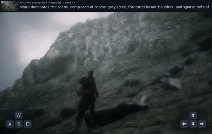](../assets/demos/action-r005-1040-window6.mp4) | **当前展示 · R0051040 · window6** 同一权重，6+6+3秒；网页RGB首图协议。 天空和人物保留较好，仍有软变形；此网页视频没有匹配RGB分数，非实时。 [完整MP4](../assets/demos/action-r005-1040-window6.mp4) |
| [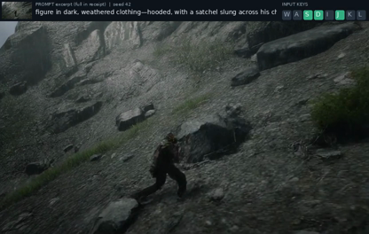](../assets/demos/action-r003-240-3s.mp4) | **R003 · step240 · 3秒诊断** 降低动作注入尺度，只训练 Adapter。 碎裂减轻但仍有拖影；短窗 flow 指标不等于15秒画质。 [完整MP4](../assets/demos/action-r003-240-3s.mp4) |
| [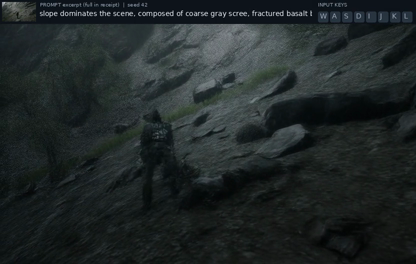](../assets/demos/action-r004-780-15s.mp4) | **R004 · step780** 改用静态场景文本，保持 Adapter-only。 后段半透明与重影仍在；flow 均值相对匹配基线小幅下降。 [完整MP4](../assets/demos/action-r004-780-15s.mp4) |
| [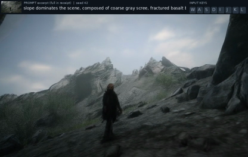](../assets/demos/action-r005-500-15s.mp4) | **R005 · step500** 重新启用 LoRA 学习率2e-6。 人物轮廓比R004更完整，仍模糊；此配对仅有correct视频。 [完整MP4](../assets/demos/action-r005-500-15s.mp4) |
| [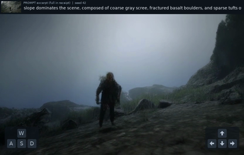](../assets/demos/action-r005-1040-chunked.mp4) | **R005 · step1040 · 5×3秒** 同分支续训1040，旧短窗顺序续写。 后段模糊/变形；RGB correct .046604，高于zero，未过双对照。 [完整MP4](../assets/demos/action-r005-1040-chunked.mp4) |
| [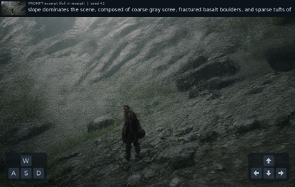](../assets/demos/action-r005-1040-joint61.mp4) | **R005 · step1040 · joint61** 同一权重，改为整段联合推理。 RGB correct .031943，低于两对照，但抬头退步，未采用。 [完整MP4](../assets/demos/action-r005-1040-joint61.mp4) |
| [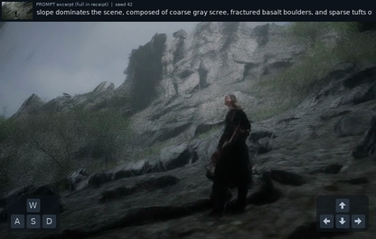](../assets/demos/action-r007-260.mp4) | **R007 · step260** 49帧Action重采样训练分支。 后段变暗、视角偏地面；correct .056376，不及zero。 [完整MP4](../assets/demos/action-r007-260.mp4) |
| [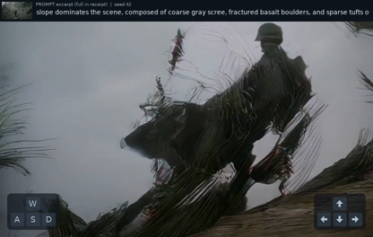](../assets/demos/causal-r006-1280.mp4) | **Causal R006 · step1280** 因果teacher forcing；本片为sliding-window。 后段严重变形；不能把另一FullKV配置的计时挂到本片。 [完整MP4](../assets/demos/causal-r006-1280.mp4) |
| [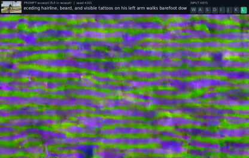](../assets/demos/longforcing-lite-80.mp4) | **LongForcing-lite · step80 · 失败** 4步学生、40步教师端点监督；非DMD。 另一场景/seed4201，明显纹理化；不能与seed42表直接排名。 [完整MP4](../assets/demos/longforcing-lite-80.mp4) |
| [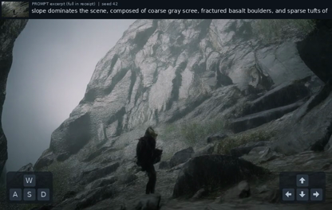](../assets/demos/native97-resampled-120.mp4) | **native97 resampled · step120** 连续97帧训练与绝对索引重采样。 correct .027365，单例双对照过线；人物仍偏细、边缘软化，未替换展示。 [完整MP4](../assets/demos/native97-resampled-120.mp4) |
| [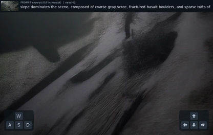](../assets/demos/causal-clean60.mp4) | **Causal clean · step60** 干净历史续训对照。 6秒仍有极细长人物，9/15秒消失；并非无误差的GT辅助视频。 [完整MP4](../assets/demos/causal-clean60.mp4) |
| [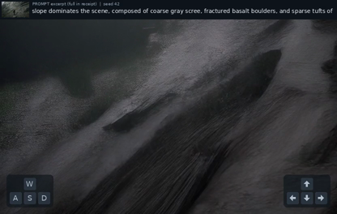](../assets/demos/causal-recycling60.mp4) | **Causal recycling · step60 · 失败** 历史条件注入此前预测的误差。 约6秒丢人，后段拉丝；没有长期稳定性收益。 [完整MP4](../assets/demos/causal-recycling60.mp4) |
| [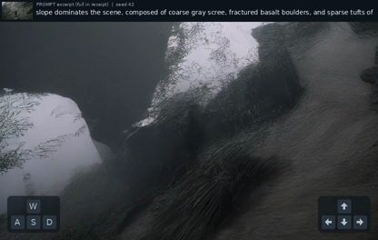](../assets/demos/history-noise20.mp4) | **History-noise · step20 · 失败** 同clean60父模型，真实历史加高斯噪声。 6秒丢人、15秒斜纹；匹配clean20也失败，不只归因于噪声。 [完整MP4](../assets/demos/history-noise20.mp4) |

## 观看与数据边界

- MP4保留原H.264视频帧与时间顺序，只移除音轨、章节和来源容器元数据并重新封装；这些源片本来就没有音轨。人物、视角和模型失败没有修图、插帧或替换。
- HUD保留各阶段原有布局；旧版可能只有顶部按键，新版是左下WASD/右下方向键。顶部文字是当时模型输入的截取，不公开完整私有运行收据。
- 缩略图取7.5秒，R003取1.5秒；README的GIF为4fps、320像素宽缩放抽帧预览，旧window6预览为416像素宽。完整MP4均为16fps，不能把GIF的大小/帧率或视频播放帧率当成模型生成性能。
- RAW画面832×480，带输入栏视频832×528。49/241帧分别对应首尾跨度3/15秒；重封装后的精确容器时长见媒体清单。
- RGB指标计算自历史原始RAW成片，不在HUD/缩略图/GIF上计算。尤其固定window6网页片的分数是缺失的，另一冻结latent协议的辅助值不能写成它的得分。
- 数据与来源遵循[第三方说明](../THIRD_PARTY_NOTICES.md)；不发布原始数据集视频、模型权重、训练日志、主机或授权记录。
